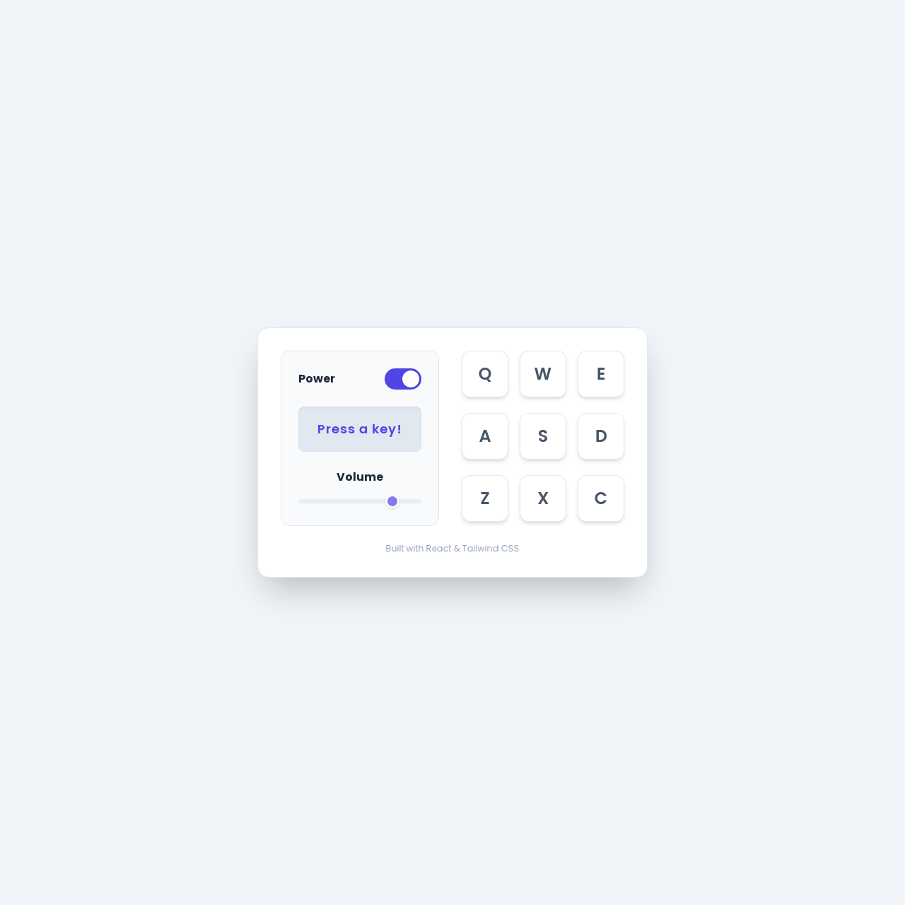

# 🥁 Drum Machine

Aplikasi **Drum Machine** interaktif yang dibangun dengan **React (via CDN)** + **TailwindCSS**.  
Proyek ini merupakan implementasi dari [FreeCodeCamp Frontend Libraries Project](https://www.freecodecamp.org/learn/front-end-development-libraries/#front-end-development-libraries-projects).  

✨ Fitur:
- 9 drum pads interaktif dengan tombol keyboard (Q, W, E, A, S, D, Z, X, C).
- Memainkan suara drum saat diklik atau tombol keyboard ditekan.
- Tampilan nama klip audio di **display** saat dipicu.
- Toggle power untuk mengaktifkan/mematikan mesin drum.
- Kontrol volume dengan slider.
- Animasi visual saat drum pad aktif.
- Desain responsif menggunakan **TailwindCSS**.

---

## 🚀 Demo
👉 [Lihat Live Demo di GitHub Pages](https://ddekaee.github.io/drumMachine)  

---

## 🛠️ Teknologi yang digunakan
- [React 17](https://reactjs.org/) (via CDN, tanpa build tools)
- [TailwindCSS](https://tailwindcss.com/)
- [FreeCodeCamp Test Suite](https://cdn.freecodecamp.org/testable-projects-fcc/v1/bundle.js)

---

## 📸 Preview


---

## 📦 Cara Menjalankan
1. Clone repo ini:
   ```bash
   git clone https://github.com/ddekaee/drumMachine.git
Buka file index.html di browser.

Selesai ✅
